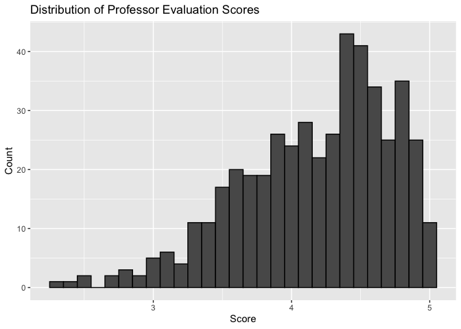
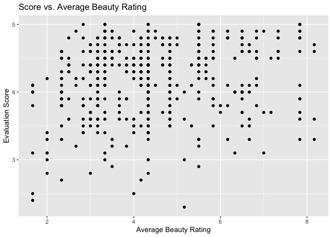
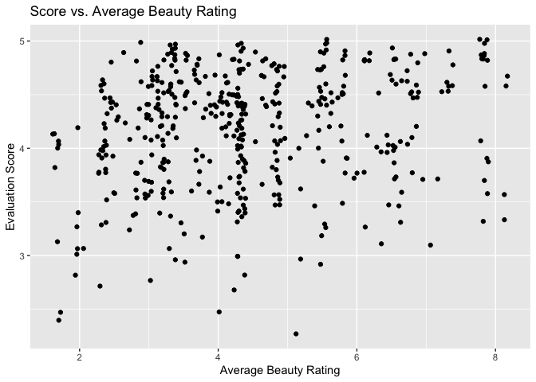
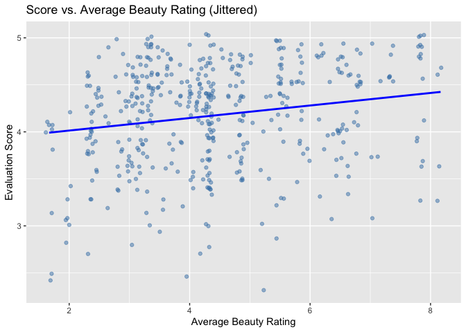

Lab 10 - Grading the professor
================
Cynthia Deng
03/03/2026

Here is a link to the [lab
instructions](https://datascience4psych.github.io/DataScience4Psych/lab10.html).

## Load Packages and Data

``` r
library(tidyverse) 
library(tidymodels)
library(openintro)
```

## Part 1 Exercise 1

The distribution of score is left-skewed. Students are generous, the
median is 4.3 and the mean is 4.175, meaning more than half of
professors were rated above 4.3. The middle 50% of scores fall between
3.8 and 4.6 (IQR), and virtually no one scores near the bottom — the
minimum is 2.3, but that’s clearly rare. The mean being slightly below
the median is consistent with left skew.

``` r
ggplot(evals, aes(x = score)) +
  geom_histogram(binwidth = 0.1, color = "black") +
  labs(title = "Distribution of Professor Evaluation Scores",
       x = "Score", y = "Count")
```

<!-- -->

``` r
summary(evals$score)
```

    ##    Min. 1st Qu.  Median    Mean 3rd Qu.    Max. 
    ##   2.300   3.800   4.300   4.175   4.600   5.000

## Exercise 2

There is a weak positive trend. Professors with higher beauty ratings
tend to score slightly higher. But the relationship has a lot of noise.
Points are spread widely across the full range of scores at nearly every
beauty rating. Notably, points appear stacked in vertical lines, this
may mean that beauty ratings take on only a limited set of discrete
values.

``` r
ggplot(evals, aes(x = bty_avg, y = score)) +
  geom_point() +
  labs(title = "Score vs. Average Beauty Rating",
       x = "Average Beauty Rating", y = "Evaluation Score")
```

<!-- -->

## Exercise 3

Jittering adds a small amount of random noise to each point so that
overlapping observations are spread apart and visible. In the original
plot, many points were stacked directly on top of each other because
both score and bty_avg probably take discrete values. Someone looking
only at the non-jittered plot might think the dataset is smaller than it
is, since many points are hidden behind each other.

``` r
ggplot(evals, aes(x = bty_avg, y = score)) +
  geom_jitter() +
  labs(title = "Score vs. Average Beauty Rating",
       x = "Average Beauty Rating", y = "Evaluation Score")
```

<!-- -->

## Part 2 Exercise 1

``` r
m_bty <- lm(score ~ bty_avg, data = evals)
tidy(m_bty)
```

    ## # A tibble: 2 × 5
    ##   term        estimate std.error statistic   p.value
    ##   <chr>          <dbl>     <dbl>     <dbl>     <dbl>
    ## 1 (Intercept)   3.88      0.0761     51.0  1.56e-191
    ## 2 bty_avg       0.0666    0.0163      4.09 5.08e-  5

``` r
summary(m_bty)
```

    ## 
    ## Call:
    ## lm(formula = score ~ bty_avg, data = evals)
    ## 
    ## Residuals:
    ##     Min      1Q  Median      3Q     Max 
    ## -1.9246 -0.3690  0.1420  0.3977  0.9309 
    ## 
    ## Coefficients:
    ##             Estimate Std. Error t value Pr(>|t|)    
    ## (Intercept)  3.88034    0.07614   50.96  < 2e-16 ***
    ## bty_avg      0.06664    0.01629    4.09 5.08e-05 ***
    ## ---
    ## Signif. codes:  0 '***' 0.001 '**' 0.01 '*' 0.05 '.' 0.1 ' ' 1
    ## 
    ## Residual standard error: 0.5348 on 461 degrees of freedom
    ## Multiple R-squared:  0.03502,    Adjusted R-squared:  0.03293 
    ## F-statistic: 16.73 on 1 and 461 DF,  p-value: 5.083e-05

score = 3.880 + 0.067 \* bty_avg

## Exercise 2

``` r
ggplot(evals, aes(x = bty_avg, y = score)) +
  geom_jitter(alpha = 0.5, color = "steelblue") +
  geom_smooth(method = "lm", color = "blue", se = FALSE) +
  labs(title = "Score vs. Average Beauty Rating (Jittered)",
       x = "Average Beauty Rating", y = "Evaluation Score")
```

    ## `geom_smooth()` using formula = 'y ~ x'

<!-- -->

## Exercise 3

Slope: For each one-point increase in average beauty rating, the model
predicts an increase of about 0.067 points in evaluation score.

Intercept: The intercept of 3.880 represents the predicted evaluation
score for a professor with a beauty rating of 0. This is not meaningful
in context.

R²: The R² value is approximately 0.035, meaning beauty rating explains
only about 3.5% of the variation in evaluation scores.

The shading around the regression line represents the uncertainty in
where the true line lies. Reading too much into the slope at this stage
risks overstating a relationship that is real but very weak.

## Part 3 Exercise 1

The reference level is female.

The gendermale coefficient of 0.142 tells us that male professors score
about 0.142 points higher on average than female professors.

Female: 4.09 Male: 4.09 + 0.142 = 4.232

``` r
m_gen <- lm(score ~ gender, data = evals)
tidy(m_gen)
```

    ## # A tibble: 2 × 5
    ##   term        estimate std.error statistic p.value
    ##   <chr>          <dbl>     <dbl>     <dbl>   <dbl>
    ## 1 (Intercept)    4.09     0.0387    106.   0      
    ## 2 gendermale     0.142    0.0508      2.78 0.00558

## Exercise 2

``` r
evals <- evals %>%
  mutate(
    rank_relevel = relevel(rank, ref = "tenure track"),
    tenure_eligible = ifelse(rank == "teaching", "no", "yes")
  )

# Fit the three models
m_rank <- lm(score ~ rank, data = evals)
m_rank_relevel <- lm(score ~ rank_relevel, data = evals)
m_tenure_eligible <- lm(score ~ tenure_eligible, data = evals)

summary(m_rank)
```

    ## 
    ## Call:
    ## lm(formula = score ~ rank, data = evals)
    ## 
    ## Residuals:
    ##     Min      1Q  Median      3Q     Max 
    ## -1.8546 -0.3391  0.1157  0.4305  0.8609 
    ## 
    ## Coefficients:
    ##                  Estimate Std. Error t value Pr(>|t|)    
    ## (Intercept)       4.28431    0.05365  79.853   <2e-16 ***
    ## ranktenure track -0.12968    0.07482  -1.733   0.0837 .  
    ## ranktenured      -0.14518    0.06355  -2.284   0.0228 *  
    ## ---
    ## Signif. codes:  0 '***' 0.001 '**' 0.01 '*' 0.05 '.' 0.1 ' ' 1
    ## 
    ## Residual standard error: 0.5419 on 460 degrees of freedom
    ## Multiple R-squared:  0.01163,    Adjusted R-squared:  0.007332 
    ## F-statistic: 2.706 on 2 and 460 DF,  p-value: 0.06786

``` r
summary(m_rank_relevel)
```

    ## 
    ## Call:
    ## lm(formula = score ~ rank_relevel, data = evals)
    ## 
    ## Residuals:
    ##     Min      1Q  Median      3Q     Max 
    ## -1.8546 -0.3391  0.1157  0.4305  0.8609 
    ## 
    ## Coefficients:
    ##                      Estimate Std. Error t value Pr(>|t|)    
    ## (Intercept)           4.15463    0.05214  79.680   <2e-16 ***
    ## rank_relevelteaching  0.12968    0.07482   1.733   0.0837 .  
    ## rank_releveltenured  -0.01550    0.06228  -0.249   0.8036    
    ## ---
    ## Signif. codes:  0 '***' 0.001 '**' 0.01 '*' 0.05 '.' 0.1 ' ' 1
    ## 
    ## Residual standard error: 0.5419 on 460 degrees of freedom
    ## Multiple R-squared:  0.01163,    Adjusted R-squared:  0.007332 
    ## F-statistic: 2.706 on 2 and 460 DF,  p-value: 0.06786

``` r
summary(m_tenure_eligible)
```

    ## 
    ## Call:
    ## lm(formula = score ~ tenure_eligible, data = evals)
    ## 
    ## Residuals:
    ##     Min      1Q  Median      3Q     Max 
    ## -1.8438 -0.3438  0.1157  0.4360  0.8562 
    ## 
    ## Coefficients:
    ##                    Estimate Std. Error t value Pr(>|t|)    
    ## (Intercept)          4.2843     0.0536  79.934   <2e-16 ***
    ## tenure_eligibleyes  -0.1406     0.0607  -2.315    0.021 *  
    ## ---
    ## Signif. codes:  0 '***' 0.001 '**' 0.01 '*' 0.05 '.' 0.1 ' ' 1
    ## 
    ## Residual standard error: 0.5413 on 461 degrees of freedom
    ## Multiple R-squared:  0.0115, Adjusted R-squared:  0.009352 
    ## F-statistic: 5.361 on 1 and 461 DF,  p-value: 0.02103

## Exercise 3

Model 1 (baseline = teaching): The intercept of 4.284 is the predicted
score for teaching faculty. Tenure track professors score 0.130 points
lower and tenured professors score 0.145 points lower compared to
teaching faculty.

Model 2 (baseline = tenure track): The intercept of 4.155 is the
predicted score for tenure track faculty. Teaching faculty score 0.130
points higher than tenure track. Tenured faculty score only 0.016 points
lower than tenure track.

Model 3 (baseline = not tenure eligible = teaching): The intercept of
4.284 is the predicted score for teaching faculty. Tenure-eligible
faculty (tenure track + tenured combined) score 0.141 points lower.

## Exercise 4

m_rank: R² = 0.012 m_rank_relevel: R² = 0.012 m_tenure_eligible: R² =
0.012

Rank explains very little of the variation in evaluation scores. All
three models have an R² of about 0.012, meaning rank accounts for only
around 1% of the variance in scores.

## Part 4

``` r
m_bty <- lm(score ~ bty_avg, data = evals)
m_bty_gen <- lm(score ~ bty_avg + gender, data = evals)

summary(m_bty)
```

    ## 
    ## Call:
    ## lm(formula = score ~ bty_avg, data = evals)
    ## 
    ## Residuals:
    ##     Min      1Q  Median      3Q     Max 
    ## -1.9246 -0.3690  0.1420  0.3977  0.9309 
    ## 
    ## Coefficients:
    ##             Estimate Std. Error t value Pr(>|t|)    
    ## (Intercept)  3.88034    0.07614   50.96  < 2e-16 ***
    ## bty_avg      0.06664    0.01629    4.09 5.08e-05 ***
    ## ---
    ## Signif. codes:  0 '***' 0.001 '**' 0.01 '*' 0.05 '.' 0.1 ' ' 1
    ## 
    ## Residual standard error: 0.5348 on 461 degrees of freedom
    ## Multiple R-squared:  0.03502,    Adjusted R-squared:  0.03293 
    ## F-statistic: 16.73 on 1 and 461 DF,  p-value: 5.083e-05

``` r
summary(m_bty_gen)
```

    ## 
    ## Call:
    ## lm(formula = score ~ bty_avg + gender, data = evals)
    ## 
    ## Residuals:
    ##     Min      1Q  Median      3Q     Max 
    ## -1.8305 -0.3625  0.1055  0.4213  0.9314 
    ## 
    ## Coefficients:
    ##             Estimate Std. Error t value Pr(>|t|)    
    ## (Intercept)  3.74734    0.08466  44.266  < 2e-16 ***
    ## bty_avg      0.07416    0.01625   4.563 6.48e-06 ***
    ## gendermale   0.17239    0.05022   3.433 0.000652 ***
    ## ---
    ## Signif. codes:  0 '***' 0.001 '**' 0.01 '*' 0.05 '.' 0.1 ' ' 1
    ## 
    ## Residual standard error: 0.5287 on 460 degrees of freedom
    ## Multiple R-squared:  0.05912,    Adjusted R-squared:  0.05503 
    ## F-statistic: 14.45 on 2 and 460 DF,  p-value: 8.177e-07

## Exercise 1

The beauty slope increases slightly from 0.067 to 0.074 when gender is
added to the model.

## Exercise 2

Yes. Holding beauty rating constant, male professors are predicted to
score 0.172 points higher than female professors.

## Exercise 3

Adding gender nearly increase the explained variance, going from 3.5% to
5.9%.

## Exercise 4

``` r
m_bty_rank <- lm(score ~ bty_avg + rank, data = evals)
summary(m_bty_rank)
```

    ## 
    ## Call:
    ## lm(formula = score ~ bty_avg + rank, data = evals)
    ## 
    ## Residuals:
    ##     Min      1Q  Median      3Q     Max 
    ## -1.8713 -0.3642  0.1489  0.4103  0.9525 
    ## 
    ## Coefficients:
    ##                  Estimate Std. Error t value Pr(>|t|)    
    ## (Intercept)       3.98155    0.09078  43.860  < 2e-16 ***
    ## bty_avg           0.06783    0.01655   4.098 4.92e-05 ***
    ## ranktenure track -0.16070    0.07395  -2.173   0.0303 *  
    ## ranktenured      -0.12623    0.06266  -2.014   0.0445 *  
    ## ---
    ## Signif. codes:  0 '***' 0.001 '**' 0.01 '*' 0.05 '.' 0.1 ' ' 1
    ## 
    ## Residual standard error: 0.5328 on 459 degrees of freedom
    ## Multiple R-squared:  0.04652,    Adjusted R-squared:  0.04029 
    ## F-statistic: 7.465 on 3 and 459 DF,  p-value: 6.88e-05

Slope: Holding rank constant, each one-point increase in average beauty
rating predicts a 0.068 point increase in evaluation score.

One Rank coefficient: The coefficient for tenure track is -0.161,
meaning that tenure track professors are predicted to score 0.161 points
lower than teaching faculty with the same beauty rating.

## Part 5 Exercise 1

``` r
?evals
```

cls_profs: the number of professors teaching sections of the course
tells you nothing about the professor’s teaching quality or any other
characteristic that might influence student evaluations.

## Exercise 2

``` r
m_cls_profs <- lm(score ~ cls_profs, data = evals)
summary(m_cls_profs)
```

    ## 
    ## Call:
    ## lm(formula = score ~ cls_profs, data = evals)
    ## 
    ## Residuals:
    ##     Min      1Q  Median      3Q     Max 
    ## -1.8554 -0.3846  0.1154  0.4154  0.8446 
    ## 
    ## Coefficients:
    ##                 Estimate Std. Error t value Pr(>|t|)    
    ## (Intercept)      4.18464    0.03111 134.493   <2e-16 ***
    ## cls_profssingle -0.02923    0.05343  -0.547    0.585    
    ## ---
    ## Signif. codes:  0 '***' 0.001 '**' 0.01 '*' 0.05 '.' 0.1 ' ' 1
    ## 
    ## Residual standard error: 0.5443 on 461 degrees of freedom
    ## Multiple R-squared:  0.0006486,  Adjusted R-squared:  -0.001519 
    ## F-statistic: 0.2992 on 1 and 461 DF,  p-value: 0.5847

## Exercise 3

I should not include cls_did_eval. The percent of students who completed
the evaluation is mathematically determined by the number who completed
it and the total number of students. Including all three would introduce
multicollinearity.

## Exercise 4

``` r
m_full <- lm(score ~ rank + ethnicity + gender + language + age + 
               cls_perc_eval + cls_students + cls_level + cls_profs + 
               cls_credits + bty_avg, data = evals)

summary(m_full)
```

    ## 
    ## Call:
    ## lm(formula = score ~ rank + ethnicity + gender + language + age + 
    ##     cls_perc_eval + cls_students + cls_level + cls_profs + cls_credits + 
    ##     bty_avg, data = evals)
    ## 
    ## Residuals:
    ##      Min       1Q   Median       3Q      Max 
    ## -1.84482 -0.31367  0.08559  0.35732  1.10105 
    ## 
    ## Coefficients:
    ##                         Estimate Std. Error t value Pr(>|t|)    
    ## (Intercept)            3.5305036  0.2408200  14.660  < 2e-16 ***
    ## ranktenure track      -0.1070121  0.0820250  -1.305 0.192687    
    ## ranktenured           -0.0450371  0.0652185  -0.691 0.490199    
    ## ethnicitynot minority  0.1869649  0.0775329   2.411 0.016290 *  
    ## gendermale             0.1786166  0.0515346   3.466 0.000579 ***
    ## languagenon-english   -0.1268254  0.1080358  -1.174 0.241048    
    ## age                   -0.0066498  0.0030830  -2.157 0.031542 *  
    ## cls_perc_eval          0.0056996  0.0015514   3.674 0.000268 ***
    ## cls_students           0.0004455  0.0003585   1.243 0.214596    
    ## cls_levelupper         0.0187105  0.0555833   0.337 0.736560    
    ## cls_profssingle       -0.0085751  0.0513527  -0.167 0.867458    
    ## cls_creditsone credit  0.5087427  0.1170130   4.348  1.7e-05 ***
    ## bty_avg                0.0612651  0.0166755   3.674 0.000268 ***
    ## ---
    ## Signif. codes:  0 '***' 0.001 '**' 0.01 '*' 0.05 '.' 0.1 ' ' 1
    ## 
    ## Residual standard error: 0.504 on 450 degrees of freedom
    ## Multiple R-squared:  0.1635, Adjusted R-squared:  0.1412 
    ## F-statistic: 7.331 on 12 and 450 DF,  p-value: 2.406e-12

## Exercise 5

``` r
m_backward <- stats::step(m_full, direction = "backward")
```

    ## Start:  AIC=-621.66
    ## score ~ rank + ethnicity + gender + language + age + cls_perc_eval + 
    ##     cls_students + cls_level + cls_profs + cls_credits + bty_avg
    ## 
    ##                 Df Sum of Sq    RSS     AIC
    ## - rank           2    0.4325 114.74 -623.91
    ## - cls_profs      1    0.0071 114.31 -623.63
    ## - cls_level      1    0.0288 114.34 -623.54
    ## - language       1    0.3501 114.66 -622.24
    ## - cls_students   1    0.3923 114.70 -622.07
    ## <none>                       114.31 -621.66
    ## - age            1    1.1818 115.49 -618.90
    ## - ethnicity      1    1.4771 115.78 -617.71
    ## - gender         1    3.0515 117.36 -611.46
    ## - cls_perc_eval  1    3.4284 117.74 -609.98
    ## - bty_avg        1    3.4287 117.74 -609.97
    ## - cls_credits    1    4.8017 119.11 -604.61
    ## 
    ## Step:  AIC=-623.91
    ## score ~ ethnicity + gender + language + age + cls_perc_eval + 
    ##     cls_students + cls_level + cls_profs + cls_credits + bty_avg
    ## 
    ##                 Df Sum of Sq    RSS     AIC
    ## - cls_profs      1    0.0103 114.75 -625.87
    ## - cls_level      1    0.0173 114.76 -625.84
    ## - cls_students   1    0.3645 115.11 -624.44
    ## <none>                       114.74 -623.91
    ## - language       1    0.5568 115.30 -623.67
    ## - age            1    0.8918 115.63 -622.32
    ## - ethnicity      1    1.7046 116.44 -619.08
    ## - gender         1    3.1469 117.89 -613.38
    ## - cls_perc_eval  1    3.5245 118.27 -611.90
    ## - bty_avg        1    3.5642 118.31 -611.75
    ## - cls_credits    1    5.6754 120.42 -603.56
    ## 
    ## Step:  AIC=-625.87
    ## score ~ ethnicity + gender + language + age + cls_perc_eval + 
    ##     cls_students + cls_level + cls_credits + bty_avg
    ## 
    ##                 Df Sum of Sq    RSS     AIC
    ## - cls_level      1    0.0162 114.77 -627.80
    ## - cls_students   1    0.3731 115.12 -626.36
    ## <none>                       114.75 -625.87
    ## - language       1    0.5552 115.31 -625.63
    ## - age            1    0.8964 115.65 -624.27
    ## - ethnicity      1    1.8229 116.57 -620.57
    ## - gender         1    3.1375 117.89 -615.38
    ## - cls_perc_eval  1    3.5166 118.27 -613.89
    ## - bty_avg        1    3.5547 118.31 -613.74
    ## - cls_credits    1    5.8278 120.58 -604.93
    ## 
    ## Step:  AIC=-627.8
    ## score ~ ethnicity + gender + language + age + cls_perc_eval + 
    ##     cls_students + cls_credits + bty_avg
    ## 
    ##                 Df Sum of Sq    RSS     AIC
    ## - cls_students   1    0.3569 115.12 -628.36
    ## <none>                       114.77 -627.80
    ## - language       1    0.5390 115.31 -627.63
    ## - age            1    0.8828 115.65 -626.25
    ## - ethnicity      1    1.8948 116.66 -622.22
    ## - gender         1    3.1222 117.89 -617.37
    ## - cls_perc_eval  1    3.5266 118.29 -615.79
    ## - bty_avg        1    3.5461 118.31 -615.71
    ## - cls_credits    1    6.2703 121.04 -605.17
    ## 
    ## Step:  AIC=-628.36
    ## score ~ ethnicity + gender + language + age + cls_perc_eval + 
    ##     cls_credits + bty_avg
    ## 
    ##                 Df Sum of Sq    RSS     AIC
    ## <none>                       115.12 -628.36
    ## - language       1    0.6192 115.74 -627.88
    ## - age            1    0.9342 116.06 -626.62
    ## - ethnicity      1    1.8997 117.02 -622.79
    ## - cls_perc_eval  1    3.1769 118.30 -617.76
    ## - gender         1    3.4709 118.59 -616.61
    ## - bty_avg        1    4.0096 119.13 -614.51
    ## - cls_credits    1    6.1046 121.23 -606.44

``` r
summary(m_backward)
```

    ## 
    ## Call:
    ## lm(formula = score ~ ethnicity + gender + language + age + cls_perc_eval + 
    ##     cls_credits + bty_avg, data = evals)
    ## 
    ## Residuals:
    ##     Min      1Q  Median      3Q     Max 
    ## -1.9067 -0.3103  0.0849  0.3712  1.0611 
    ## 
    ## Coefficients:
    ##                        Estimate Std. Error t value Pr(>|t|)    
    ## (Intercept)            3.446967   0.203191  16.964  < 2e-16 ***
    ## ethnicitynot minority  0.204710   0.074710   2.740 0.006384 ** 
    ## gendermale             0.184780   0.049889   3.704 0.000238 ***
    ## languagenon-english   -0.161463   0.103213  -1.564 0.118427    
    ## age                   -0.005008   0.002606  -1.922 0.055289 .  
    ## cls_perc_eval          0.005094   0.001438   3.543 0.000436 ***
    ## cls_creditsone credit  0.515065   0.104860   4.912 1.26e-06 ***
    ## bty_avg                0.064996   0.016327   3.981 7.99e-05 ***
    ## ---
    ## Signif. codes:  0 '***' 0.001 '**' 0.01 '*' 0.05 '.' 0.1 ' ' 1
    ## 
    ## Residual standard error: 0.503 on 455 degrees of freedom
    ## Multiple R-squared:  0.1576, Adjusted R-squared:  0.1446 
    ## F-statistic: 12.16 on 7 and 455 DF,  p-value: 2.879e-14

score = 3.447 + 0.205(ethnicity: not minority) + 0.185(gender: male) -
0.161(language: non-english) - 0.005(age) + 0.005(cls_perc_eval) +
0.515(cls_credits: one credit) + 0.065(bty_avg)

## Exercise 6

Numerical predictor (age): Holding all other variables constant, each
one-year increase in a professor’s age is associated with a predicted
decrease of 0.005 points in evaluation score.

Categorical predictor (gender): Holding all other variables constant,
male professors are predicted to score 0.185 points higher than female
professors.

## Exercise 7

Based on the final model, a high-scoring professor at UT Austin would
tend to be male, non-minority, younger, more attractive, and educated at
an English-speaking institution, teaching a one-credit course with high
student participation in evaluations. Notably, many of these
characteristics – such as gender, ethnicity, and attractiveness – have
nothing to do with actual teaching quality, highlighting the broader
concern that course evaluations may reflect bias as much as
instructional effectiveness.

## Exercise 8

No, these conclusions should not be generalized to professors at other
universities. The data comes entirely from one institution, which has a
specific student population, culture, and course structure that may not
be representative of universities broadly.
